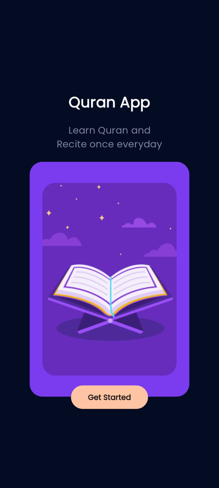
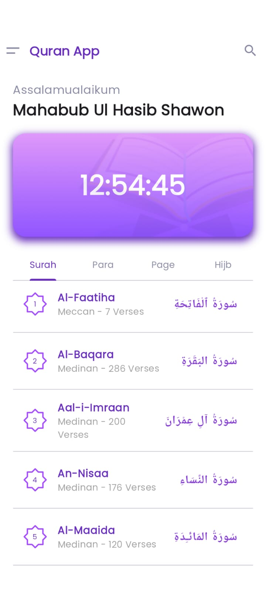
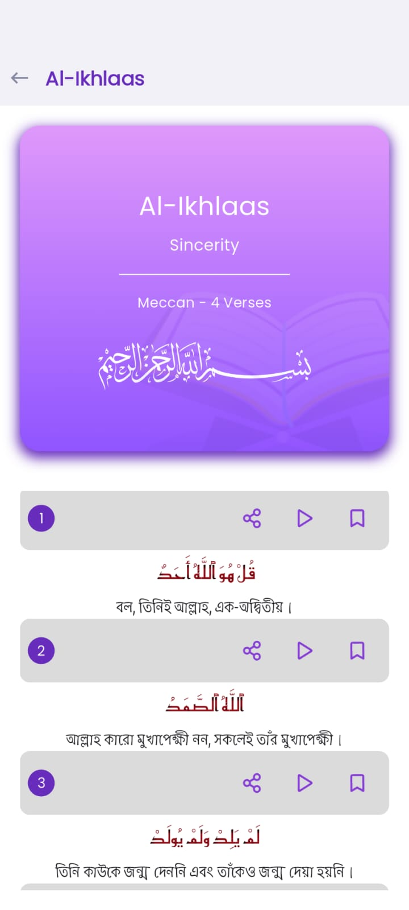
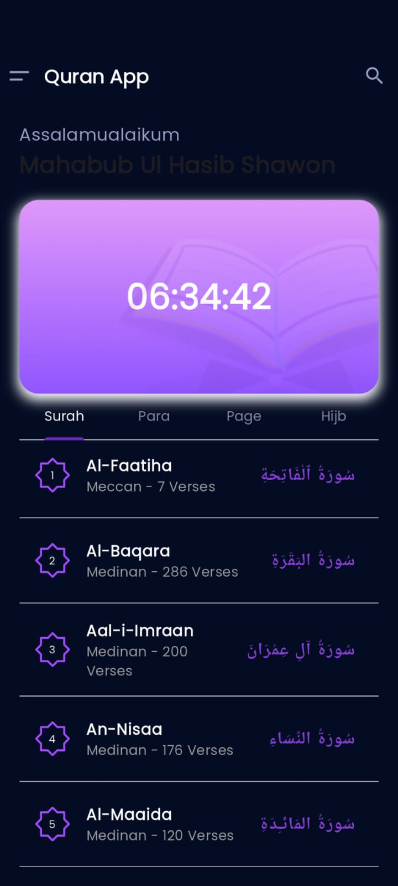

# 📖 Al Quran App (Flutter)

A beautifully designed Flutter app to read the Holy Quran. The app displays a list of Surahs, detailed verses of each Surah, local time, and supports both Light and Dark modes. It also features a splash screen and uses an external API to fetch Quranic data.

---

## ✨ Features

- 🕌 List of all Surahs (Chapters)
- 📜 Detailed view of each Surah with verses
- ⏰ Real-time local time display
- 🌗 Light and Dark Mode toggle
- 🚀 Splash Screen on startup
- 📡 Fetches Quran data using API

---

## 📱 Screenshots

| Splash Screen | Surah List | Surah Details | Light Mode | Dark Mode |
|---------------|------------|----------------|-------------|------------|
|  |  |  |  |  |


---

## 🛠️ Tech Stack

- **Flutter**
- **Dart**
- **API**: [Quran API]("http://api.alquran.cloud/v1/surah")
- **State Management**: Cubit / Provider (depending on your implementation)
- **Theme**: Light/Dark using `ThemeMode`
- **DateTime**: `intl` package for local time formatting

---

## 🚧 Project Structure

```

lib/
├── cubit/
│   ├── surah_cubit.dart
│   ├── surah_details_cubit.dart
│   ├── surah_details_state.dart
│   ├── surah_state.dart
│   └── time_cubit.dart
│
├── models/
│   └── surah_list_model.dart
│   └── surah_details_model.dart
│
├── presentation/
│   ├── detail_screen.dart
│   ├── home_screen.dart
│   └── splash_screen.dart
│
├── services/
│   └── api_service.dart
│
├── utils/
│   └── theme.dart
│
├── widgets/
│   ├── quran_tabs.dart
│   ├── surah_ayat_widget.dart
│   ├── surah_tab.dart
│   └── surah_tile_widget.dart
│
└── main.dart


````

---

## 📦 Packages Used

```yaml
dependencies:
  flutter:
    sdk: flutter
  cupertino_icons: ^1.0.8
  google_fonts: ^6.2.1
  http: ^1.4.0
  flutter_bloc: ^9.1.1
  equatable: ^2.0.7
  flutter_svg: ^2.1.0
  intl: ^0.20.2
````

---

## 🔌 API Integration

We used this endpoint to get Quran Surah data:

```
http://api.alquran.cloud/v1/surah
https://quranapi.pages.dev/api/$surahNo.json
```

* Data includes Surah number, name, and verses (in Bengali).
* Use `http` package to fetch and parse the data.
* Handle API errors gracefully with loading and error states.

---

## 🌙 Light and Dark Mode

App theme adapts based on system settings or user toggle.

```dart
MaterialApp(
  theme: lightTheme,
  darkTheme: darkTheme,
  themeMode: ThemeMode.system,
);
```

You can save user preference using `SharedPreferences`.

---

## 🕐 Local Time Display

Use `intl` to show local time in your desired format:

```dart
String formattedTime = DateFormat('hh:mm a').format(DateTime.now());
```

Update the time using a `Timer.periodic` or equivalent method.

---

## 🚀 Getting Started

### 1. Clone the repo

```bash
git clone https://github.com/mahabubulhasibshawon/Al-Quran-App.git
cd al_quran_flutter_app
```

### 2. Install dependencies

```bash
flutter pub get
```

### 3. Run the app

```bash
flutter run
```

---

## 📌 To-Do

* Add audio playback for each Surah
* Add bookmarking and search functionality
* Add Tajweed color-coding (future scope)

---

## 🙏 Acknowledgements

* [Quran API]("http://api.alquran.cloud/v1/surah")
* [Flutter](https://flutter.dev)
* [Figma](https://www.figma.com/design/1dH2dGhkWO4jbVxM1JDz7l/Quran-App-Concept---Free--Community-?node-id=100-2004&p=f&t=Jjs3pHtzo9dAsaQY-0)
* \[Surah and translation data providers]

---

Made with ❤️ using Flutter


